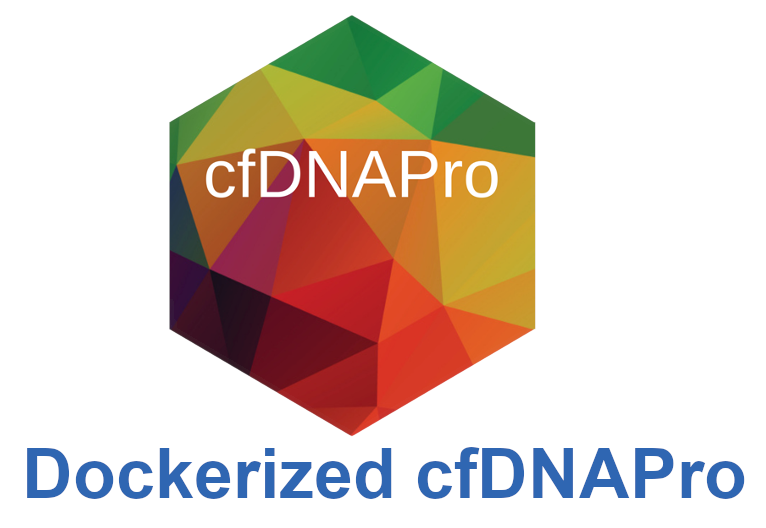
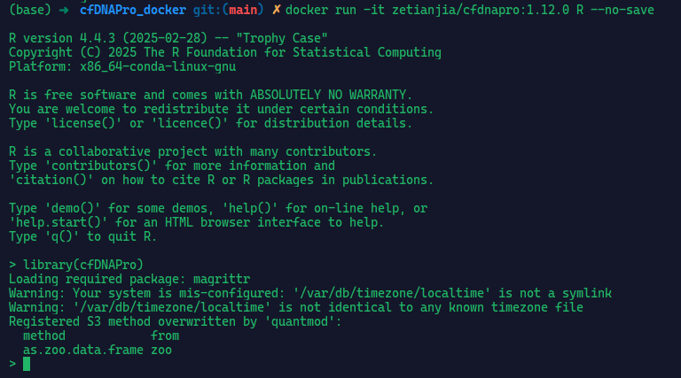

# cfDNAPro Dockerized Version 

This repository provides a **Dockerized version of [cfDNAPro](https://github.com/hw538/cfDNAPro)**, designed to address the challenge of complex dependencies and installation difficulties in the original project. It enables users to quickly deploy a ready-to-use environment for cfDNA fragmentomics analysis.

---

## About the Original Repository

cfDNAPro is a Bioconductor R package developed for standardized and robust analysis of cell-free DNA (cfDNA) fragmentomic features.

Original repository:  
https://github.com/hw538/cfDNAPro

Official documentation:  
https://cfdnapro.readthedocs.io/en/latest/

---

## Why Use This Docker Image?

The original cfDNAPro requires a large number of R and Bioconductor dependencies, which are often difficult to install. This image provides:

- Pre-installed cfDNAPro version 1.12.0
- Pre-configured R 4.4.3 environment with all dependencies resolved


---


## Quick Start (Recommended)

### Step 1: Pull the Docker Image

```bash
docker pull zetianjia/cfdnapro:1.12.0
```

### Step 2: Launch R inside the Container

```bash
docker run -it zetianjia/cfdnapro:1.12.0 R --no-save
```



### Step 3: Mount a Local Directory

```bash
docker run -it \
  -v /your/local/path:/data \
  zetianjia/cfdnapro:1.12.0 R --no-save
```

## Optional: Build Locally from Source

### Step 1: Clone the Repository

## optional-2

STEP-1: clone the repository
```
git clone https://github.com/zetian-jia/cfDNAPro_docker.git
```

STEP-2: build the docker image
```
cd cfDNAPro_docker

docker build -t zetianjia/cfdnapro:1.12.0 .
```

>   --build-arg http_proxy= \
>  --build-arg https_proxy= \
>  --build-arg HTTP_PROXY= \
>  --build-arg HTTPS_PROXY= \


## Session info

<details>
  <summary>Session info</summary>
  <pre><code> 
Package	Version
BH	1.87.0-1
BSgenome	1.74.0
BSgenome.Hsapiens.NCBI.GRCh38	1.3.1000
BSgenome.Hsapiens.UCSC.hg19	1.4.3
BSgenome.Hsapiens.UCSC.hg38	1.4.5
Biobase	2.66.0
BiocGenerics	0.52.0
BiocIO	1.16.0
BiocParallel	1.40.0
Biostrings	2.74.0
DelayedArray	0.32.0
Deriv	4.1.6
Formula	1.2-5
GenomeInfoDb	1.42.0
GenomeInfoDbData	1.2.13
GenomicAlignments	1.42.0
GenomicRanges	1.58.0
IRanges	2.40.0
KernSmooth	2.23-26
MASS	7.3-64
Matrix	1.7-3
MatrixGenerics	1.18.0
MatrixModels	0.5-4
ModelMetrics	1.2.2.2
R6	2.6.1
RColorBrewer	1.1-3
RCurl	1.98-1.16
Rcpp	1.0.14
RcppArmadillo	14.4.2-1
RcppEigen	0.3.4.0.2
Rdpack	2.6.4
Rhtslib	3.2.0
Rsamtools	2.22.0
S4Arrays	1.6.0
S4Vectors	0.44.0
SQUAREM	2021.1
SparseArray	1.6.0
SparseM	1.84-2
SummarizedExperiment	1.36.0
TTR	0.24.4
UCSC.utils	1.2.0
XML	3.99-0.17
XVector	0.46.0
abind	1.4-5
askpass	1.2.1
backports	1.5.0
base	4.4.3
bitops	1.0-9
boot	1.3-31
broom	1.0.8
car	3.1-3
carData	3.0-5
caret	6.0-94
cfDNAPro	1.12.0
class	7.3-23
cli	3.6.5
clock	0.7.3
codetools	0.2-20
colorspace	2.1-1
compiler	4.4.3
conquer	1.3.3
corrplot	0.95
cowplot	1.1.3
cpp11	0.5.2
crayon	1.5.3
curl	6.2.2
data.table	1.17.6
datasets	4.4.3
diagram	1.6.5
digest	0.6.37
doBy	4.6.27
dplyr	1.1.4
e1071	1.7-16
ellipsis	0.3.2
fansi	1.0.6
farver	2.1.2
foreach	1.5.2
formatR	1.14
futile.logger	1.4.3
futile.options	1.0.1
future	1.58.0
future.apply	1.20.0
gbRd	0.4.12
generics	0.1.4
ggplot2	3.5.2
ggpubr	0.6.0
ggrepel	0.9.6
ggsci	3.2.0
ggsignif	0.6.4
globals	0.18.0
glue	1.8.0
gower	1.0.1
grDevices	4.4.3
graphics	4.4.3
grid	4.4.3
gridExtra	2.3
gtable	0.3.6
hardhat	1.4.1
httr	1.4.7
ipred	0.9-15
isoband	0.2.7
iterators	1.0.14
jsonlite	2.0.0
labeling	0.4.3
lambda.r	1.2.4
lattice	0.22-7
lava	1.8.1
lifecycle	1.0.4
listenv	0.9.1
lme4	1.1-37
lubridate	1.9.4
magrittr	2.0.3
matrixStats	1.5.0
methods	4.4.3
mgcv	1.9-3
microbenchmark	1.5.0
mime	0.13
minqa	1.2.8
modelr	0.1.11
munsell	0.5.1
nlme	3.1-168
nloptr	2.2.1
nnet	7.3-20
numDeriv	2016.8-1.1
openssl	2.3.3
pROC	1.18.5
parallel	4.4.3
parallelly	1.45.0
pbkrtest	0.5.4
pillar	1.10.2
pkgconfig	2.0.3
plyr	1.8.9
plyranges	1.26.0
polynom	1.4-1
prodlim	2025.04.28
progressr	0.15.1
proxy	0.4-27
purrr	1.0.4
quantmod	0.4.27
quantreg	6.00
rbibutils	2.3
recipes	1.3.1
reformulas	0.4.1
reshape2	1.4.4
restfulr	0.0.15
rjson	0.2.23
rlang	1.1.6
rpart	4.1.24
rstatix	0.7.2
rtracklayer	1.66.0
scales	1.4.0
shape	1.4.6.1
snow	0.4-4
sparsevctrs	0.3.4
splines	4.4.3
stats	4.4.3
stats4	4.4.3
stringi	1.8.7
stringr	1.5.1
survival	3.8-3
sys	3.4.3
tcltk	4.4.3
tibble	3.3.0
tidyr	1.3.1
tidyselect	1.2.1
timeDate	4041.110
timechange	0.3.0
tools	4.4.3
tzdb	0.5.0
utf8	1.2.6
utils	4.4.3
vctrs	0.6.5
viridisLite	0.4.2
withr	3.0.2
xml2	1.3.8
xts	0.14.1
yaml	2.3.10
zlibbioc	1.52.0
zoo	1.8-14
  </code></pre>
</details>


## Citation

Please cite this paper:

Wang, H., Mennea, P.D., Chan, Y.K.E. et al. A standardized framework for robust fragmentomic feature extraction from cell-free DNA sequencing data. Genome Biol 26, 141 (2025). https://doi.org/10.1186/s13059-025-03607-5

